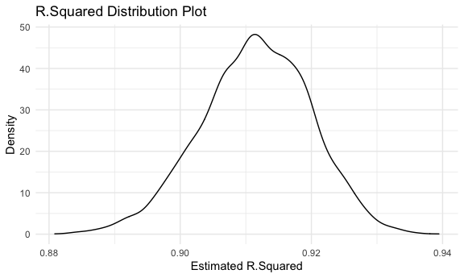

p8105\_hw6\_wq2160
================
Wenshan Qu (wq2160)
11/26/2021

## Problem 1

**Read and Tidy Data**

``` r
birthweight_df = 
  read_csv("./data/birthweight.csv") %>% 
  janitor::clean_names() %>% 
  mutate(
    babysex = factor(babysex, levels = c("1", "2")),
    frace = factor(frace, levels = c("1", "2", "3", "4", "8", "9")),
    malform = factor(malform, levels = c("0", "1")),
    mrace = factor(mrace, levels = c("1", "2", "3", "4", "8")),
    parity = as.integer(parity)
  )

birthweight_df
```

    ## # A tibble: 4,342 × 20
    ##    babysex bhead blength   bwt delwt fincome frace gaweeks malform menarche
    ##    <fct>   <dbl>   <dbl> <dbl> <dbl>   <dbl> <fct>   <dbl> <fct>      <dbl>
    ##  1 2          34      51  3629   177      35 1        39.9 0             13
    ##  2 1          34      48  3062   156      65 2        25.9 0             14
    ##  3 2          36      50  3345   148      85 1        39.9 0             12
    ##  4 1          34      52  3062   157      55 1        40   0             14
    ##  5 2          34      52  3374   156       5 1        41.6 0             13
    ##  6 1          33      52  3374   129      55 1        40.7 0             12
    ##  7 2          33      46  2523   126      96 2        40.3 0             14
    ##  8 2          33      49  2778   140       5 1        37.4 0             12
    ##  9 1          36      52  3515   146      85 1        40.3 0             11
    ## 10 1          33      50  3459   169      75 2        40.7 0             12
    ## # … with 4,332 more rows, and 10 more variables: mheight <dbl>, momage <dbl>,
    ## #   mrace <fct>, parity <int>, pnumlbw <dbl>, pnumsga <dbl>, ppbmi <dbl>,
    ## #   ppwt <dbl>, smoken <dbl>, wtgain <dbl>

**Cheking `NA`**

``` r
map_df(birthweight_df, ~sum(is.na(.))) %>% 
  knitr::kable(align = "c")
```

| babysex | bhead | blength | bwt | delwt | fincome | frace | gaweeks | malform | menarche | mheight | momage | mrace | parity | pnumlbw | pnumsga | ppbmi | ppwt | smoken | wtgain |
|:-------:|:-----:|:-------:|:---:|:-----:|:-------:|:-----:|:-------:|:-------:|:--------:|:-------:|:------:|:-----:|:------:|:-------:|:-------:|:-----:|:----:|:------:|:------:|
|    0    |   0   |    0    |  0  |   0   |    0    |   0   |    0    |    0    |    0     |    0    |   0    |   0   |   0    |    0    |    0    |   0   |  0   |   0    |   0    |

We can see that there is no `NA` value in this data.

**Fit Linear Model**

My interested predictors includes:

1.  mother’s pre-pregnancy BMI (`ppbmi`);

2.  average number of cigarettes smoked per day during pregnancy
    (`smoken`);

3.  mother’s age at delivery (years) (`momage`);

4.  gestational age in weeks (`gaweeks`).

Then we fit the linear model based on above parameters. This is a
hypothesis based multiple linear regression model, and I choose those 4
predictors (which could be seen as my hypothesis on the contributors on
birth weight) based on my epidemiological and biological knowledge, such
as the gestational status of mother (BMI, smoken, age) will definitely
influence the growth wellness of baby based on the influences of
chemical and biological signals, and premature infant tends to have a
lower weight than normal infant.

``` r
bw_fit = lm(bwt ~ ppbmi + smoken + momage + gaweeks, data = birthweight_df)

bw_fit %>% 
  broom::tidy() %>% 
  select(term, estimate, p.value) %>% 
  knitr::kable()
```

| term        |  estimate |   p.value |
|:------------|----------:|----------:|
| (Intercept) | 52.463522 | 0.6041864 |
| ppbmi       | 12.266397 | 0.0000000 |
| smoken      | -6.750317 | 0.0000000 |
| momage      | 12.019965 | 0.0000000 |
| gaweeks     | 65.472505 | 0.0000000 |

Describe modeling process: I use linear regression model to build a
relationship between a dependent variable (`bwt`) and a set of
independent variables (`ppbmi`, `smoken`, `momage`, `gaweeks`).

**Model Residuals against Fitted Values**

``` r
resid_pred_df = 
  birthweight_df %>% 
  add_residuals(bw_fit) %>% 
  add_predictions(bw_fit) %>% 
  select(pred, resid)

resid_pred_df %>% 
  ggplot(aes(x = pred, y = resid)) +
  geom_point(alpha = .5) +
  labs(
    title = "Model Residuals against Fitted Values",
    x = "Fitted Value",
    y = "Residual"
  )
```


We can see that these residuals are almost symmetric around 0, and most
of them are around 0, while some of them (outliers) are around -1000 and
1000.

**Compare Models**

The first compared model: *length at birth and gestational age as
predictors (main effects only)*

``` r
fit1 = lm(bwt ~ blength + gaweeks, data = birthweight_df)

fit1 %>% 
  broom::tidy() %>% 
  knitr::kable()
```

| term        |    estimate | std.error | statistic | p.value |
|:------------|------------:|----------:|----------:|--------:|
| (Intercept) | -4347.66707 | 97.958360 | -44.38281 |       0 |
| blength     |   128.55569 |  1.989891 |  64.60439 |       0 |
| gaweeks     |    27.04673 |  1.717930 |  15.74379 |       0 |

The second compared model: *head circumference, length, sex, and all
interactions (including the three-way interaction) between these*

``` r
fit2 = lm(bwt ~ bhead * blength * babysex, data = birthweight_df)

fit2 %>% 
  broom::tidy() %>% 
  knitr::kable()
```

| term                   |      estimate |    std.error |  statistic |   p.value |
|:-----------------------|--------------:|-------------:|-----------:|----------:|
| (Intercept)            | -7176.8170221 | 1264.8397394 | -5.6740920 | 0.0000000 |
| bhead                  |   181.7956350 |   38.0542051 |  4.7772811 | 0.0000018 |
| blength                |   102.1269235 |   26.2118095 |  3.8962180 | 0.0000992 |
| babysex2               |  6374.8683508 | 1677.7669213 |  3.7996150 | 0.0001469 |
| bhead:blength          |    -0.5536096 |    0.7802092 | -0.7095656 | 0.4780117 |
| bhead:babysex2         |  -198.3931810 |   51.0916850 | -3.8830816 | 0.0001047 |
| blength:babysex2       |  -123.7728875 |   35.1185360 | -3.5244319 | 0.0004288 |
| bhead:blength:babysex2 |     3.8780531 |    1.0566296 |  3.6702106 | 0.0002453 |

**Make this comparison in terms of the cross-validated prediction
error**

``` r
cv_df = 
  crossv_mc(birthweight_df, 100) %>% 
  mutate(
      train = map(train, as_tibble),
      test = map(test, as_tibble)
  ) %>% 
  mutate(
      a_mod = map(.x = train, ~lm(bwt ~ ppbmi + smoken + momage + gaweeks, data = .x)),
      b_mod = map(.x = train, ~lm(bwt ~ blength + gaweeks, data = .x)),
      c_mod = map(.x = train, ~lm(bwt ~ bhead * blength * babysex, data = .x))
  ) %>% 
  mutate(
      rmse_a = map2_dbl(.x = a_mod, .y = test, ~rmse(model = .x, data = .y)),
      rmse_b = map2_dbl(.x = b_mod, .y = test, ~rmse(model = .x, data = .y)),
      rmse_c = map2_dbl(.x = c_mod, .y = test, ~rmse(model = .x, data = .y))
  )

cv_df %>% 
  select(.id, starts_with("rmse")) %>% 
  pivot_longer(
    rmse_a:rmse_c,
    names_to = "model",
    values_to = "rmse",
    names_prefix = "rmse_"
  ) %>% 
  ggplot(aes(x = model, y = rmse)) +
  geom_violin() +
  labs(
    title = "Comparasion between Three Different Models",
    subtitle = "a = my model, b = fit1 model, c = fit2 model",
    x = "Model", 
    y = "RMSE"
  )
```


Comment: We can see that the Model C (which is the second given model
defined as `bwt ~ bhead * blength * babysex`) has the lowest RMSE and
has the best fit, while Model A (which is my model, defined as
`bwt ~ ppbmi + smoken + momage + gaweeks`) has the worst fit. It is
quite reasonable for the Model C contains not only the main effects, but
also the interactions.

## Problem 2

**Load the Data**

``` r
weather_df = 
  rnoaa::meteo_pull_monitors(
    c("USW00094728"),
    var = c("PRCP", "TMIN", "TMAX"), 
    date_min = "2017-01-01",
    date_max = "2017-12-31") %>%
  mutate(
    name = recode(id, USW00094728 = "CentralPark_NY"),
    tmin = tmin / 10,
    tmax = tmax / 10) %>%
  select(name, id, everything())
```

**5000 Bootstrap**

``` r
boot_df = 
  weather_df %>% 
  bootstrap(n = 5000, id = "strap_number") %>% 
  mutate(
    model = map(.x = strap, ~lm(tmax ~ tmin, data = .x)),
    results_tidy = map(model, broom::tidy),
    results_glance = map(model, broom::glance)
  ) %>% 
  select(strap_number, results_tidy, results_glance) %>% 
  unnest(results_tidy, results_glance) %>% 
  janitor::clean_names() %>% 
  select(strap_number, term, estimate, r_squared) %>% 
  pivot_wider(
    names_from = term, 
    values_from = estimate
  ) %>% 
  rename("beta_0" = "(Intercept)", "beta_1" = "tmin") %>% 
  mutate(
    log_beta = log(beta_0 * beta_1)
  ) %>% 
  select(strap_number, r_squared, log_beta)

boot_df
```

    ## # A tibble: 5,000 × 3
    ##    strap_number r_squared log_beta
    ##    <chr>            <dbl>    <dbl>
    ##  1 0001             0.921     2.01
    ##  2 0002             0.916     1.97
    ##  3 0003             0.906     2.05
    ##  4 0004             0.923     2.00
    ##  5 0005             0.927     2.00
    ##  6 0006             0.907     2.00
    ##  7 0007             0.915     2.00
    ##  8 0008             0.932     2.03
    ##  9 0009             0.908     2.02
    ## 10 0010             0.911     1.99
    ## # … with 4,990 more rows

**Plot Estimated R Squared**

``` r
boot_df %>% 
  ggplot(aes(x = r_squared)) +
  geom_density() + 
  labs(
    title = "R.Squared Distribution Plot",
    x = "Estimated R.Squared",
    y = "Density"
  )
```



Comment: The distribution of `R.Squared` represents a little left-skewed
(but almost normal) bell-shape curve, and the mean is around 0.911 (r
squared is between 0 and 1, and larger the value, better the fit). We
can conclude that most of the r squared are quite close to 1, thus the
linear model of `tmin` and `tmax` fits really well.

**Plot log(beta\_0 \* beta\_1)**

``` r
boot_df %>% 
  ggplot(aes(x = log_beta)) +
  geom_density() + 
  labs(
    title = "Log(beta_0 * beta_1) Distribution Plot",
    x = "log(beta_0 * beta_1)",
    y = "Density"
  )
```


Comment: The distribution of `log(beta_0 * beta_1)` is almost normal
distribution (a well bell-shape curve), and the mean value is around
2.013.

**95% Confidence Interval**

``` r
## R.Squared
ci_r = 
  boot_df %>% 
  pull(r_squared) %>% 
  quantile(c(0.025, 0.975))

ci_r
```

    ##      2.5%     97.5% 
    ## 0.8944259 0.9270078

``` r
## log(beta_0 * beta_1)
ci_log = 
  boot_df %>% 
  pull(log_beta) %>% 
  quantile(c(0.025, 0.975))

ci_log 
```

    ##     2.5%    97.5% 
    ## 1.965737 2.058421

Thus, the 95% CI of `R.Squared` is (0.894, 0.927), the 95% CI of
`log(beta_0 * beta_1)` is (1.966, 2.058). At the significance level of
0.05, we are 95% confident that the true R.Squared will lies between
0.895 and 0.928, and the true log(beta\_0 \* beta\_1) will lies between
1.965 and 2.059.
